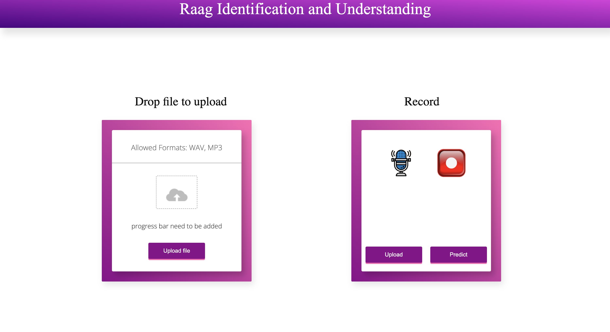
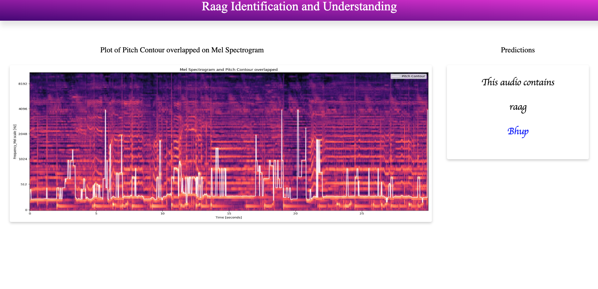

# Raag Identification and Understanding

A web application that identifies Indian classical music ragas from audio files or recordings.

## Overview

This application uses a Convolutional Neural Network (CNN) to classify audio into five different Indian classical raags:
- Alahiya Bilaval
- Bhup
- Malkauns
- Miyan Malhar
- Yaman Kalyan

The system processes audio files to generate mel spectrograms and pitch contours, which are then used for classification.

## Demo

Here are some screenshots demonstrating the application:

### Homepage


### Results with Mel Spectrogram and Pitch Contour


## Features

- Upload audio files (WAV, MP3, M4A)
- Record audio directly in the browser
- Visualize mel spectrograms and pitch contours
- Predict raag from provided audio

## Technologies

- Python 3.x
- Flask web framework
- TensorFlow and Keras for deep learning
- Librosa for audio processing
- Docker for containerization

## Audio Processing

1. **Mel Spectrogram Generation**:
   - Audio is loaded using Librosa
   - Mel spectrograms are generated with 128 mel bands and a maximum frequency of 8000 Hz
   - Power-to-dB conversion for better visualization
   - Images are resized to 504×432 pixels for model input

2. **Pitch Contour Extraction**:
   - Librosa's piptrack function extracts pitch information
   - Pitch contours are overlaid on mel spectrograms for visualization
   - This combined visualization helps in understanding the melodic patterns

### Data Flow

```
Audio File/Recording → Convert to WAV → Feature Extraction → Mel Spectrogram → 
Visualization → CNN Model → Raag Classification
```

## Prerequisites

- Docker

## Docker Setup

### Building the Docker Image

1. Clone the repository:
   ```
   git clone <repository-url>
   cd Raag_Identification
   ```

2. Build the Docker image:
   ```
   docker build -t raag-identification .
   ```

### Running the Container

Run the container with the following command:

```
docker run -p 8000:8000 --name raag-app raag-identification
```

The application will be accessible at http://localhost:8000

### Docker Options

- To run the container in the background:
  ```
  docker run -d -p 8000:8000 --name raag-app raag-identification
  ```

- To stop the container:
  ```
  docker stop raag-app
  ```

- To remove the container:
  ```
  docker rm raag-app
  ```

- To rebuild the container (after code changes):
  ```
  docker build -t raag-identification .
  docker run -p 8000:8000 --name raag-app raag-identification
  ```

## Usage

1. Access the web application through your browser at http://localhost:8000

2. You can either:
   - Upload an audio file (WAV, MP3, M4A) using the upload section
   - Record audio directly in the browser using the record section

3. After uploading or recording, the system will:
   - Generate visualizations (mel spectrogram and pitch contour)
   - Process the audio through the CNN model
   - Display the predicted raag

## Project Structure

- `main.py`: Flask application entry point
- `model.py`: CNN architecture and prediction functionality
- `features.py`: Audio feature extraction (mel spectrogram, pitch)
- `convertWAV.py`: Audio format conversion
- `config.py`: Application configuration
- `templates/`: HTML templates
- `static/`: Static assets (CSS, JS, images)

## Troubleshooting

- If uploads fail, check file permissions in the static/uploads directory
- Audio conversion issues may be related to ffmpeg installation
- Browser microphone access requires HTTPS or localhost
- Docker container logs can be viewed with: `docker logs raag-app`

## License

[Your License Information] 